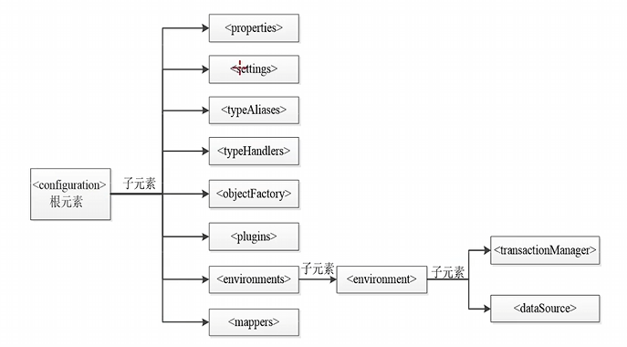

## MyBatis 核心配置文件中的主要元素



。需要注意的是，在核心配置文件中，`<configuration>` 的子元素必须按照上图由上到下的顺序进行配置，否则MyBatis在解析XML配置文件的时候会报错。 

重点学习：`<properties>` (引入外部properties)、`<settings>` (改变MyBatis的默认行为)、`<typeAliases>` (别名映射)、`<environments>` (数据元环境配置)、`<mappers>` (配置映射文件)标签

### `<properties>` 元素

`<properties`>用来加载外部的properties文件

具体语法如下：

```java title="db.properties"
jdbc.driver=com.mysql.cj.jdbc.Driver

jdbc.url=jdbc:mysql://localhost:3306/mybatis

jdbc.username=root

jdbc.password=root
```

```xml title="mybatis-config.xml"
<properties resource="db.properties" /> <!-- (1)! -->
<dataSource type="POOLED">
    <!-- 数据库驱动 -->
    <property name="driver" value="${jdbc.driver}" />
    <!-- 连接数据库的url -->
    <property name="url" value="${jdbc.url}" />
    <!-- 连接数据库的用户名 -->
    <property name="username" value="${jdbc.username}" />
    <!-- 连接数据库的密码 -->
    <property name="password" value="${jdbc.password}" />
</dataSource>
```

1. `resource` 用于从类路径加载配置文件 `db.properties`，是最常用的方式。`url` 是绝对路径，灵活性差，不常在项目中使用。

完成上述配置后，`<dataSource>` 元素中连接数据库的 4 个属性（driver、url、username 和 password）值将会由db.properties 文件中对应的值来动态替换。这样一来，`<properties>` 元素就可以通过 db.properties 文件实现动态参数配置。 

### `<settings`> 元素

企业开发对于数据库的列名的命名规范：多个单词间下划线隔开，而 Java 代码的命名规范为驼峰命名。

如果在实际项目中这样命名，运行测试时是不会通过的，因为实体属性名和列名不一致，MyBatis 不能自动映射。因此需要用 `<settings>` 标签来解决这个问题，以及一些其他设置。

| 配置参数 | 描述 |
| :----: | :----: |
| cacheEnabled | 是否开启缓存 |
| lazyLoadingEnabled | 延迟加载的全局开关 |
| mapUnderscoreToCamelCase | 是否开启自动驼峰命名规则（camel case）映射 |
| ... | 其他用到再加 |

```xml title="具体使用方式"
<settings>
    <!-- 是否开启缓存 -->
    <setting name="cacheEnabled" value="true" />
    <!-- 是否开启延迟加载,如果开启,所有关联对象都会延迟加载 -->
    <setting name="lazyLoadingEnabled" value="true" />
    <!-- 是否开启关联对象属性的延迟加载,如果开启,对任意延迟属性的调用都
    会使用带有延迟加载属性的对象向完整加载,否则每种属性都按需加载 -->
    <setting name="aggressiveLazyLoading" value="true" />
    ...
</settings>
```

### `<TypeAliases>` 元素

核心配置文件若要引用一个POJO实体类，要用`包.类名`的形式:

```xml title="引用POJO实体"
<select id="findById" parameterType="int" resultType="com.itheima.pojo.User">
       select * from users where uid = #{id}
</select>
```

这样太长容易打错，而且麻烦，可以用 `<TypeAliases>` 元素进行别名映射

多个全限定类设置别名的方式

方式一：在 `<typeAliases>` 元素下，使用多个 `<typeAlias>` 元素为每一个全限定类逐个配置别名。

```xml title="为每个类单独配置别名"
<typeAliases>
    <typeAlias alias="User" type="com.itheima.pojo.User"/>
    <typeAlias alias="Student" type="com.itheima.pojo.Student"/>
    <typeAlias alias="Employee"   type="com.itheima.pojo.Employee"/>
    <typeAlias alias="Animal" type="com.itheima.pojo.Animal"/>
</typeAliases>
```

实体特别多不可能一条条手写，因此，可以用包扫描，默认实体类名就是别名。

方式二：通过自动扫描包的形式自定义别名。

```xml title="包扫描"
<typeAliases>
    <package name="com.itheima.pojo"/>
</typeAliases>
```

除了可以使用 `<typeAliases>` 元素为实体类自定义别名外，MyBatis 框架还为许多常见的 Java 类型（如数值、字符串、日期和集合等）提供了相应的默认别名。例如别名 `_byte` 映射类型 `byte`、`_long` 映射类型 `long` 等，别名可以在 MyBatis 中直接使用，但由于别名不区分大小写，所以在使用时要注意重复定义的覆盖问题。

### `<environment>` 元素

MyBatis可以配置多套运行环境，如开发环境、测试环境、生产环境等，我们可以灵活选择不同的配置，从而将SQL映射到不同运行环境的数据库中。不同的运行环境可以通过 `<environments>` 元素来配置，但不管增加几套运行环境，都必须要明确选择出当前要用的唯一的一个运行环境。 

MyBatis的运行环境信息包括事务管理器和数据源。在MyBatis的核心配置文件中，MyBatis通过`<environments>` 元素定义一个运行环境。`<environment>` 元素有两个子元素，`<transactionManager>`元素和 `<daraSource>` 元素。`<transactionManager>` 元素用于配置运行环境的事务管理器；`<daraSource>` 元素用于配置运行环境的数据源信息。

```xml title="示例代码"
<environments default="development">
    <!-- development 为当前数据库配置环境的唯一标识 -->
    <environment id="development">
        <transactionManager type="JDBC" /><!—设置使用JDBC事务管理 -->
        <dataSource type="POOLED"> <!-配置数据源 -->
            <property name="driver" value="${jdbc.driver}" />
            <property name="url" value="${jdbc.url}" />
            <property name="username" value="${jdbc.username}" />
            <property name="password" value="${jdbc.password}" />
        </dataSource>
    </environment>  ...
</environments>
```
在MyBatis中，`<transcationManager>` 元素可以配置两种类型的事务管理器，分别是JDBC和MANAGED。

- JDBC：此配置直接使用JDBC的提交和回滚设置，它依赖于从数据源得到的连接来管理事务的作用域。

- MANAGED：此配置不提交或回滚一个连接，而是让容器来管理事务的整个生命周期。默认情况下，它会关闭连接，但可以将 `<transcationManager>` 元素的closeConnection属性设置为false来阻止它默认的关闭行为。

项目中使用Spring+MyBatis，则没必要在MyBatis中配置事务管理器，实际开发中，项目会使用Spring自带的管理器来实现事务管理。对于数据源的配置，MyBatis提供了UNPOOLED、POOLED和JNDI三种数据源类型。

{==UNPOOLED==}表示数据源为无连接池类型。配置此数据源类型后，程序在每次被请求时会打开和关闭数据库连接。UNPOOLED适用于对性能要求不高的简单应用程。UNPOOLED类型的数据源需要配置5种属性。

|                属性                |         说明         |
| :------------------------------: | :----------------: |
|              driver              | JDBC驱动的Java类的完全限定名 |
|               url                |     数据库的URL地址      |
|             username             |     登录数据库的用户名      |
|             password             |      登录数据库的密码      |
| defaultTransactionIsolationLevel |    默认的连接事务隔离级别     |

POOLED表示数据源为连接池类型。POOLED数据源利用“池”的概念将JDBC连接对象组织起来，节省了在创建新的连接对象时需要初始化和认证的时间。POOLED数据源使得并发Web应用可以快速的响应请求，是当前比较流行的数据源配置类型。

- [ ] 如果有需要，再在这里加，现在这ppt里的东西完全看不懂

### `<mappers>` 元素

`<mappers>` 元素用于引入MyBatis映射文件。映射文件包含了POJO对象和数据表之间的映射信息，通过`<mappers>` 元素引入映射文件的方法有4种。

=== "使用类路径引入"
    ```xml
    <mappers>
        <mapper resource="com/itheima/mapper/UserMapper.xml"/>
    </mappers>
    ```

=== "使用本地路径引入"
    ```xml
    <mappers>
        <mapper url="file:///D:/com/itheima/mapper/UserMapper.xml"/>
    </mappers>
    ```

=== "使用类接口引入"
    ```xml
    <mappers>
        <mapper class="com.itheima.mapper.UserMapper"/>
    </mappers>
    ```

=== "使用包名引入"
    ```xml
    <mappers>
        <package name="com.itheima.mapper"/>
    </mappers>
    ```