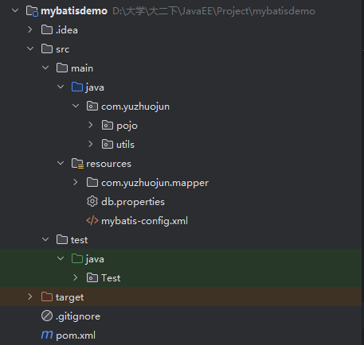

## MyBatis 项目结构



## 工具类

```Java title='工具类实例'
package com.example.utils;

import org.apache.ibatis.io.Resources;
import org.apache.ibatis.session.SqlSession;
import org.apache.ibatis.session.SqlSessionFactory;
import org.apache.ibatis.session.SqlSessionFactoryBuilder;

import java.io.Reader;

public class MyBatisUtils {
    private static SqlSessionFactory sqlSessionFactory = null;
    static {
        try {
            Reader reader = Resources.getResourceAsReader("mybatis-config.xml");
            sqlSessionFactory = new SqlSessionFactoryBuilder().build(reader);
        } catch (Exception e) {
            e.printStackTrace();
        }
    }
    public static SqlSession getSession() {
        return sqlSessionFactory.openSession();
    }
}
```

工具类不需要创建实例(对外提供的方法是 static 类型)就可以使用，主要用来创建SqlSession

```Java title='使用方法'
SqlSession session = MyBatisUtils.getSession();
```